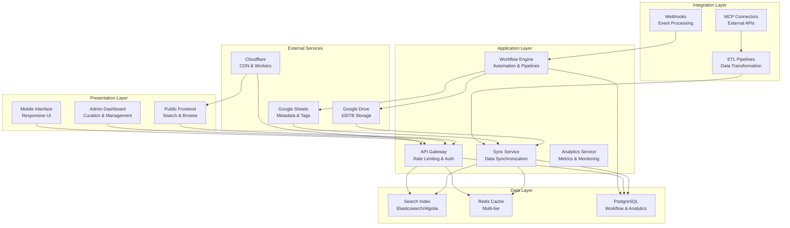

# Design Document

## Overview

The Advanced Search and Filtering System will transform the ISO Archive from a simple Google Drive index into a sophisticated, community-driven archival platform. The system addresses the unique challenges of managing 100TB+ of diverse operating system ISOs while serving multiple user personas through scalable, crowd-sourced workflows similar to Wikipedia, ProtonDB, and specialized archival databases.

The architecture leverages the existing Next.js foundation while introducing new components for data synchronization, search indexing, workflow automation, and community curation. The design emphasizes horizontal scalability, cost optimization through intelligent caching, and maintainability through modular, pluggable components.

## Architecture

### High-Level System Architecture



### Component Architecture

The system follows a microservices-inspired architecture with clear separation of concerns:

**Data Synchronization Layer**: Handles bidirectional sync between Google Drive, Google Sheets, and internal data stores with conflict resolution and eventual consistency.

**Search & Discovery Layer**: Provides high-performance, faceted search capabilities with intelligent caching and query optimization.

**Workflow Automation Layer**: Manages content ingestion, validation, curation pipelines, and community-driven processes.

**Community Curation Layer**: Implements Wikipedia-style collaborative editing with reputation systems, peer review, and quality control mechanisms.

**API & Integration Layer**: Exposes versioned APIs with rate limiting, authentication, and support for multiple client types.

## Components and Interfaces

### 1. Data Synchronization Service

**Purpose**: Maintain consistency between Google Drive file structure, Google Sheets metadata, and internal search indices.

**Key Interfaces**:
```typescript
interface SyncService {
  syncDriveToSheets(): Promise<SyncResult>
  syncSheetsToIndex(): Promise<SyncResult>
  handleFileMove(fileId: string, newPath: string): Promise<void>
  detectDuplicates(file: FileMetadata): Promise<DuplicateMatch[]>
  validateMetadata(metadata: ISOMetadata): Promise<ValidationResult>
}

interface SyncResult {
  processed: number
  errors: SyncError[]
  conflicts: ConflictResolution[]
  duration: number
}
```

**Implementation Strategy**:
- Event-driven architecture using Google Drive API webhooks
- Incremental sync with change detection and delta processing
- Conflict resolution using last-writer-wins with manual override capability
- Retry mechanisms with exponential backoff for transient failures

### 2. Search Index Engine

**Purpose**: Provide fast, faceted search across ISO metadata with support for complex queries and real-time filtering.

**Key Interfaces**:
```typescript
interface SearchEngine {
  index(documents: ISODocument[]): Promise<IndexResult>
  search(query: SearchQuery): Promise<SearchResult>
  suggest(partial: string): Promise<Suggestion[]>
  facets(filters: FilterSet): Promise<FacetCounts>
  similar(isoId: string): Promise<ISODocument[]>
}

interface SearchQuery {
  text?: string
  filters: {
    osType?: string[]
    architecture?: string[]
    dateRange?: [Date, Date]
    verified?: boolean
    language?: string[]
  }
  sort: SortOption[]
  pagination: PaginationConfig
}
```

**Technology Choices**:
- **Primary**: Elasticsearch for complex queries and analytics
- **Alternative**: Algolia for managed service with excellent performance
- **Fallback**: PostgreSQL full-text search for cost optimization

### 3. Workflow Automation Engine

**Purpose**: Automate content ingestion, validation, and curation processes while supporting human-in-the-loop workflows.

**Key Interfaces**:
```typescript
interface WorkflowEngine {
  createPipeline(definition: PipelineDefinition): Promise<Pipeline>
  executePipeline(pipelineId: string, input: any): Promise<ExecutionResult>
  scheduleTask(task: ScheduledTask): Promise<TaskId>
  handleWebhook(event: WebhookEvent): Promise<void>
}

interface PipelineDefinition {
  name: string
  triggers: TriggerConfig[]
  steps: WorkflowStep[]
  errorHandling: ErrorPolicy
  retryPolicy: RetryConfig
}
```

**Workflow Examples**:
- **New File Ingestion**: Detect → Extract Metadata → Virus Scan → Duplicate Check → Queue for Curation
- **Metadata Validation**: Parse Filename → Validate Schema → Check Completeness → Flag Issues
- **Community Curation**: Review Queue → Peer Review → Consensus Building → Approval → Publication

### 4. Community Curation System

**Purpose**: Enable Wikipedia-style collaborative editing with reputation systems and quality control.

**Key Interfaces**:
```typescript
interface CurationSystem {
  submitEdit(edit: MetadataEdit): Promise<EditResult>
  reviewEdit(editId: string, review: Review): Promise<void>
  calculateReputation(userId: string): Promise<ReputationScore>
  detectVandalism(edit: MetadataEdit): Promise<VandalismScore>
  buildConsensus(conflictId: string): Promise<ConsensusResult>
}


interface MetadataEdit {
  isoId: string
  field: string
  oldValue: any
  newValue: any
  rationale: string
  sources: string[]
  contributor: ContributorId
}
```

**Reputation System**:
- Points for accepted contributions, quality improvements, and peer reviews
- Penalties for rejected edits, vandalism, and policy violations
- Progressive permissions based on reputation levels
- Expert reviewer roles for specialized domains (vintage systems, specific architectures)

### 5. Analytics and Monitoring Service

**Purpose**: Provide comprehensive observability into system performance, user behavior, and content metrics.

**Key Interfaces**:
```typescript
interface AnalyticsService {
  trackEvent(event: AnalyticsEvent): Promise<void>
  generateReport(query: ReportQuery): Promise<Report>
  getMetrics(timeRange: TimeRange): Promise<Metrics>
  detectAnomalies(): Promise<Anomaly[]>
  exportData(format: ExportFormat): Promise<ExportResult>
}

interface AnalyticsEvent {
  type: 'search' | 'download' | 'edit' | 'view'
  userId?: string
  metadata: Record<string, any>
  timestamp: Date
}
```

## Data Models

### Core Data Structures


naming_convention = {os_name}.{os_family}.{release_date}.iso

dirty_file_name.iso: drive_1234

rename files.id(1234) -> edubuntu.ubuntu.24.04.

drive_1234 {
  id: 1234
  osName: whatever
}

ON field update, RENAME file where ID = id

"workflow" / "pipeline"

{type}.{letter}.{os_family}.{version}
linux/a/ubuntu/24.04/daskhjdksadnj.iso
bsd/a/


on field update, MOVE file to the correct path
reupdates the db of the new path and etc


```typescript
interface ISODocument {
  id: string
  driveFileId: string
  filename: string
  canonicalPath: string
  
  // Parsed metadata
  osType: string
  osName: string
  osFamily: string
  version: string
  edition?: string
  architecture: string
  wrapper?: string
  isoType: string
  buildDate: Date
  language: string

  endangered: boolean <- this is what should always keep archived
  (where as for newer distros that are likely on official mirrors, we can redirect if storage becomes low)

  magnetUrl: string
  torrentHash: string
  
  // File properties
  size: number
  checksums: {
    sha256?: string
    sha1?: string
    md5?: string
  }
  
  // Verification status
  verified: boolean
  virusScanResult?: ScanResult
  authenticity: AuthenticityLevel
  
  // Community data
  completenessScore: number
  qualityScore: number
  lastCurated: Date
  curatedBy: string[]
  
  // Search optimization
  searchTerms: string[]
  tags: string[]
  popularity: number
}

interface CurationWorkflow {
  id: string
  isoId: string
  status: 'pending' | 'in_review' | 'approved' | 'rejected'
  submittedBy: string
  submittedAt: Date
  
  changes: MetadataChange[]
  reviews: Review[]
  consensus?: ConsensusResult
  
  priority: number
  category: 'new_file' | 'metadata_update' | 'quality_improvement'
}

interface ContributorProfile {
  id: string
  reputation: number (if above 5, allow voting on edits, if above 10, allow auto accepted edits)
  specializations: string[]
  contributionStats: {
    editsSubmitted: number
    editsAccepted: number
    reviewsCompleted: number
    qualityScore: number
  }
  permissions: Permission[]
  joinDate: Date
}
```

joe updates xyz.iso and gives it a distro name of ubuntu
bill votes +1 on that edit
bob votes +1 on that edit
edit approved

sally (lvl 10) makes edit, auto accepted

sally edited xyz.iso with a new value of distro: ubuntu


| pending for review |

- edit 1 [+1 -
- edit 2 [+1 -1]
- edit 3 


### Schema Evolution Strategy

The system uses versioned schemas with backward compatibility:

```typescript
interface SchemaVersion {
  version: number
  migrations: Migration[]
  deprecatedFields: string[]
  newFields: FieldDefinition[]
}

interface Migration {
  from: number
  to: number
  transform: (data: any) => any
  rollback: (data: any) => any
}
```

## Error Handling

### Error Classification and Recovery

**Transient Errors**: Network timeouts, rate limits, temporary service unavailability
- **Strategy**: Exponential backoff with jitter, circuit breaker pattern
- **Recovery**: Automatic retry with increasing delays

**Data Consistency Errors**: Sync conflicts, schema validation failures
- **Strategy**: Conflict resolution workflows, manual intervention queues
- **Recovery**: Human-in-the-loop resolution with audit trails

**Security Errors**: Authentication failures, authorization violations, malware detection
- **Strategy**: Immediate quarantine, security team alerts, audit logging
- **Recovery**: Manual security review and remediation

**System Errors**: Database failures, search index corruption, infrastructure issues
- **Strategy**: Graceful degradation, fallback mechanisms, automated failover
- **Recovery**: Health checks, automated recovery procedures, manual escalation

### Error Monitoring and Alerting

```typescript
interface ErrorHandler {
  classify(error: Error): ErrorCategory
  recover(error: Error, context: ErrorContext): Promise<RecoveryResult>
  escalate(error: Error, level: EscalationLevel): Promise<void>
  audit(error: Error, resolution: Resolution): Promise<void>
}

interface AlertingSystem {
  defineAlert(rule: AlertRule): Promise<AlertId>
  triggerAlert(alert: Alert): Promise<void>
  acknowledgeAlert(alertId: string, user: string): Promise<void>
  resolveAlert(alertId: string, resolution: string): Promise<void>
}
```

## Testing Strategy

### Multi-Layer Testing Approach

**Unit Testing**: Individual components and business logic
- **Framework**: Jest with TypeScript support
- **Coverage**: 90%+ for critical paths, 80%+ overall
- **Focus**: Data transformations, validation logic, utility functions

**Integration Testing**: Component interactions and external service integration
- **Framework**: Jest with test containers for databases
- **Scope**: API endpoints, database operations, external service mocks
- **Data**: Synthetic test datasets with realistic ISO metadata

**End-to-End Testing**: Complete user workflows and system behavior
- **Framework**: Playwright for browser automation
- **Scenarios**: Search workflows, curation processes, admin operations
- **Environment**: Staging environment with production-like data

**Performance Testing**: Load testing and scalability validation
- **Framework**: k6 for load testing, custom scripts for data volume testing
- **Metrics**: Response times, throughput, resource utilization
- **Scenarios**: Search under load, bulk data ingestion, concurrent curation

### Test Data Management

```typescript
interface TestDataFactory {
  createISODocument(overrides?: Partial<ISODocument>): ISODocument
  createCurationWorkflow(isoId: string): CurationWorkflow
  createContributor(reputation?: number): ContributorProfile
  generateSearchDataset(size: number): ISODocument[]
}

interface TestEnvironment {
  setupDatabase(): Promise<void>
  seedTestData(): Promise<void>
  cleanupAfterTest(): Promise<void>
  mockExternalServices(): Promise<void>
}
```

### Quality Assurance Strategy

**Code Quality**: ESLint, Prettier, TypeScript strict mode, SonarQube analysis
**Security Testing**: OWASP ZAP, dependency vulnerability scanning, penetration testing
**Accessibility Testing**: axe-core integration, manual accessibility review
**Performance Monitoring**: Lighthouse CI, Core Web Vitals tracking, real user monitoring

The testing strategy emphasizes automation, continuous integration, and production-like testing environments to ensure system reliability and user experience quality.


total (20/100%)

ubuntu (80/100 %)
- file.iso (100%)
- file2.iso (50%)
- file3.iso (10%)

  edubuntu ()

  lubuntu


debian (80/100 %)
- file.iso (100%)
- file2.iso (50%)
- file3.iso (10%)


kubuntu.blahlbha.iso:

 {os_family}
[ ubuntu ] -> link -> /ubuntu index of the archives -> which shows all the other ubuntu isos/completionm scores/useful info
[ descriptions
  history
  release date
  company
  blahlbhalh      ]
  : distrowatch
  : wikipedia
  : official pages
  : waybackmachine
  : atl.wiki
  : archwiki
  
